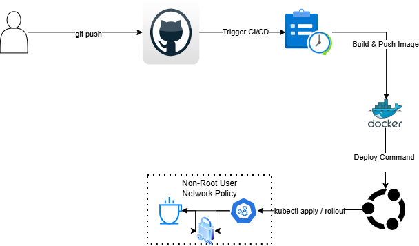

# 🚀 Tam Otomatik ve Güvenli Spring Boot CI/CD Pipeline

Bu proje, sıfırdan inşa edilmiş, modern DevOps pratiklerini ve sıkı güvenlik standartlarını içeren uçtan uca bir CI/CD ve Kubernetes dağıtım sürecini göstermektedir. 

## 🏗️ Sistem Mimarisi

Aşağıdaki şema, kodun geliştiriciden çıkıp canlı Kubernetes kümesine (Cluster) kadar uzanan yolculuğunu göstermektedir:

## ✨ Öne Çıkan Özellikler

*   **⚡ Tam Otomasyon (CI/CD):** Kod GitHub'a push edildiği anda derlenir, Docker imajı inşa edilir ve Docker Hub'a gönderilir (GitHub Actions).
*   **☁️ Self-Hosted Runner Entegrasyonu:** Bulut (GitHub) ile yerel Kubernetes kümesi arasında güvenli ve hızlı bir köprü kurulmuştur (WSL2 Ubuntu).
*   **🛡️ Sıfır Kesinti (Zero-Downtime Deployment):** Uygulama `kubectl rollout restart` ile güncellenirken kullanıcılar hiçbir kesinti yaşamaz.
*   **🔒 İleri Seviye K8s Güvenliği:**
    *   **Kısıtlı Yetki (Non-Root Container):** Uygulama, Docker içinde en yüksek yetkili olan `root` yerine, sadece kendi işini yapabilen yetkisiz `spring` kullanıcısıyla çalışır. Bu sayede olası sızıntıların etki alanı minimuma indirilmiştir.
    *   **Sıfır Güven (Network Policies):** Sisteme, sadece uygulamanın ihtiyaç duyduğu 8080 portundan gelen trafiğe izin veren, diğer tüm portları dışarıya kapatan sıkı bir ağ güvenlik duvarı (Firewall) politikası uygulanmıştır.
